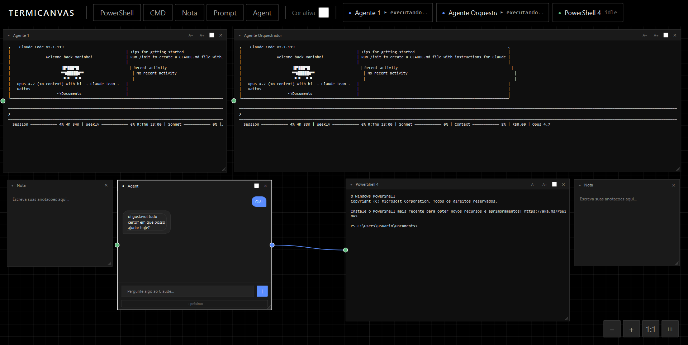
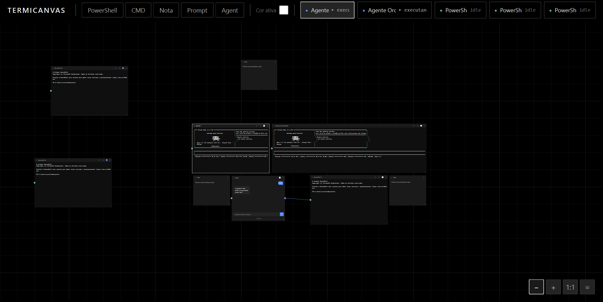

# TermiCanvas



Canvas infinito para orquestrar múltiplos terminais PowerShell/CMD em paralelo, no estilo Figma/n8n. Pensado para rodar várias CLIs (incluindo agentes de IA) lado a lado, com pan, zoom e nodes arrastáveis.

---

## O que é

Um workspace visual em que cada terminal vira um node independente no canvas. Você cria, posiciona, redimensiona e organiza terminais como se fossem caixas em um quadro infinito — útil para acompanhar várias execuções, builds, agentes ou sessões SSH sem precisar de múltiplas janelas.

Originalmente era o `Powershell-Maestro` (versão Rust, Linux-only). Foi reescrito em Python para rodar nativamente no Windows com setup mais leve.

---

## Features

### Canvas
- Canvas infinito via `QGraphicsView` + `QGraphicsScene` (50.000 x 50.000)
- **Pan:** botão do meio do mouse, ou Espaço + clique esquerdo (funciona mesmo por cima de terminais)
- **Zoom:** Ctrl + roda do mouse (0.15x até 4.0x)
- Grid quadriculado com linhas reforçadas a cada 5 quadrados
- Visual minimalista: fundo preto puro, paleta de cinzas progressivos

### Nodes
- Cantos retos (radius 0)
- Arrastáveis pelo header — drag continua mesmo se o cursor sair do widget
- Redimensionáveis pelo grip do canto inferior direito
- Fechar pelo X no header
- Borda azul ao receber foco
- **Rename inline:** duplo-clique no título abre input para renomear

### Terminais
- Digitação direta no widget (sem input box separado)
- Emulação VT100 completa via `pyte`
- **Scrollback:** 3000 linhas via `pyte.HistoryScreen`
  - Roda do mouse → rola scrollbar local
  - Shift + roda → navega páginas do histórico
- **Wheel isolado:** rola apenas o terminal sob o cursor, sem interferir no canvas
- **Copy/paste inteligente:**
  - `Ctrl+C` com seleção → copia para o clipboard
  - `Ctrl+C` sem seleção → envia SIGINT (0x03) para o shell
  - `Ctrl+V` → cola normalizando `\r\n`
- Suporte a setas, Home/End, PageUp/PageDown, Tab, Ctrl+letra
- Detecta prompt no fim do buffer e marca o terminal como "idle"

### Diálogo de novo terminal
Ao clicar em `+ PowerShell 5 / 7 / CMD`, abre um modal com:
- **Nome do terminal** (opcional, default: `PowerShell N`)
- **Diretório de trabalho** (default: `Vault/dattos-ia`)
  - Botões "Pasta padrão" e "Escolher outra..." (file picker nativo)
  - Última pasta custom escolhida persiste durante a sessão

### Sidebar
- Brand `MAESTRO` com subtítulo
- Botão `«` no topo recolhe a sidebar; botão `»` flutuante reabre
- **Seção COMANDO** — envia texto ao terminal ativo
- **Seção ADICIONAR** — botões para criar PowerShell 5 / PowerShell 7 / CMD / Agente / Nota
- **Seção TERMINAIS ABERTOS** — lista dinâmica com:
  - Nome + dot colorido (verde `idle` / azul `executando`)
  - Linha de atividade (comando atual ou `idle`)
  - Clique → canvas centraliza e foca esse terminal
- **Seção NAVEGAÇÃO** — zoom in/out, reset 100%, encaixar todos

### Widgets auxiliares
- **Notas** — `QTextEdit` livre com fundo amarelo claro
- **Agente** — chat placeholder; mensagens prefixadas com `SEND:` são enviadas como comando ao terminal ativo (ainda sem integração real com IA)

---

## Stack

| Camada | Lib | Função |
|---|---|---|
| GUI | PyQt6 | toolkit nativo, canvas via QGraphicsView |
| PTY | pywinpty | wrapper do ConPTY (API oficial do Windows 10 1903+) |
| Emulador | pyte | VT100 + HistoryScreen para scrollback |

---

## Instalação

### 1. Python 3.10+

Baixar em https://www.python.org/downloads/ e marcar **"Add Python to PATH"** durante a instalação.

```powershell
python --version
```

### 2. Dependências

```powershell
git clone https://github.com/mar1nho/termicanvas.git
cd termicanvas
pip install -r requirements.txt
```

Instala PyQt6, pywinpty e pyte (~100 MB no total).

### 3. Rodar

```powershell
python main.py
```

---

## Atalhos

| Atalho | Ação |
|---|---|
| Botão do meio (drag) | Pan no canvas |
| Espaço + clique esquerdo | Pan no canvas (mesmo sobre terminais) |
| Ctrl + roda | Zoom in/out |
| Roda sobre terminal | Scroll local do terminal |
| Shift + roda sobre terminal | Navega páginas do scrollback |
| Duplo-clique no header | Renomear node |
| Ctrl+C com seleção | Copiar |
| Ctrl+C sem seleção | Enviar SIGINT |
| Ctrl+V | Colar |

---

## Empacotar como .exe

```powershell
pip install pyinstaller
pyinstaller --onefile --windowed --name "TermiCanvas" main.py
```

Resultado em `dist\TermiCanvas.exe` (~50 MB). O usuário final não precisa de Python instalado.

---

## Limitações conhecidas

- **Sem persistência** — fechar o app perde o layout dos nodes
- **Agente é placeholder** — sem integração real com Claude/Gemini ainda
- **Sem cores ANSI** — `pyte` processa, mas o render é texto puro no `QPlainTextEdit`
- **Terminal com tamanho fixo** — 30 linhas x 100 colunas, não se ajusta ao redimensionar o node

---

## Roadmap

- Persistir layout em JSON (via `QSettings`)
- Plugar API real de Claude/Gemini no AgentWidget (subprocess + streaming de stdout)
- Cores ANSI via rich text no `QPlainTextEdit`
- Terminal responsivo ao tamanho do node
- Hotkeys globais (`Ctrl+T` novo terminal, etc.)
- Salvar/carregar workspaces nomeados



---

## Histórico

1. Primeira iteração usou `QMdiArea` (janelas MDI nativas) — descartado por não permitir canvas infinito real
2. Tentado `QGraphicsDropShadowEffect` nos nodes — quebra o render do `QPlainTextEdit` dentro de proxy widget (bug conhecido do Qt). Removido.
3. Sistema de "wires/pipes" entre terminais (estilo n8n) chegou a ser implementado e foi removido para manter o foco nos terminais.
4. Pan via Espaço usa event filter global no `QApplication` — necessário porque o terminal sempre captura foco do teclado.
5. Wheel sobre terminal precisou despachar diretamente na scrollbar do `QPlainTextEdit` (não via dispatch normal), porque o `QGraphicsView` fazia fallback para scroll do viewport.
